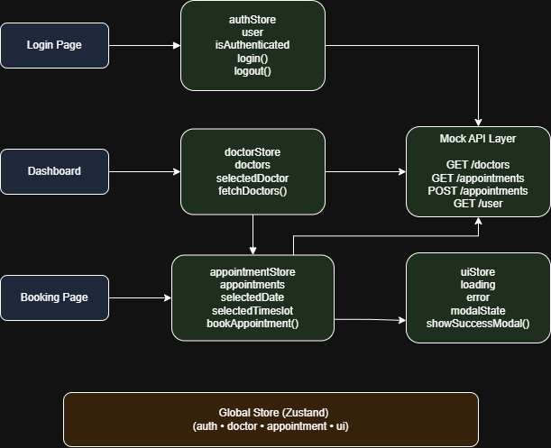

# 🏥 VitalSync – Healthcare Patient Dashboard (Frontend)

## 🚀 Live Demo

👉 **[View Live Application on Vercel](https://vital-sync-seven.vercel.app/login)**

---

## 📌 Project Overview

**VitalSync** is a modern healthcare SaaS dashboard designed to streamline the interaction between patients and doctors.
It provides a clean, intuitive interface for booking appointments, tracking health activity, and managing doctor availability.

This project focuses on building a **production-level frontend architecture** using modern UI/UX principles inspired by platforms like Stripe and Notion.

---

## 🎯 Objective

The goal of this project is to design and develop a **scalable and visually polished healthcare dashboard UI**, simulating real-world SaaS applications.

---

## 🧑💻 Track

**Frontend Development**

---

## ⚙️ Tech Stack

* **Framework:** Next.js 14 (App Router)
* **Styling:** Tailwind CSS
* **State Management:** Zustand
* **Database & Auth:** Supabase (PostgreSQL, Row Level Security, Realtime)
* **AI:** Google Gemini API (`gemini-2.5-flash`) via Next.js Route Handlers
* **Design Tool:** Figma
* **Language:** JavaScript
* **Deployment:** Vercel

---

## 🧩 Core Features

### 🔐 Authentication UI

* Login interface with role-based access (Patient / Doctor)
* Clean split-screen SaaS design

---

### 📊 Patient Dashboard

* Sidebar navigation (Dashboard, Doctors, Appointments, Profile)
* Top navbar with search and user profile
* Stats overview cards:

  * Upcoming Appointments
  * Active Doctors
  * Health Status

---

### 👨⚕️ Doctor Listing

* Display available doctors with:

  * Name, specialization
  * Rating and location
  * Availability status
* Action buttons:

  * Book Appointment
  * View Profile

---

### 📅 Appointment Booking

* Doctor profile panel
* Date selection (calendar-style UI)
* Time slot selection grid
* Confirm booking button
* Selected state highlighting

---

### 📈 Activity Tracking

* Recent activity feed
* Appointment updates and health logs

---

## 🎨 UI/UX Design

* Premium SaaS-inspired design (Stripe / Notion style)
* Clean layout with consistent spacing (8px grid)
* Soft shadows and rounded components
* Minimal and accessible interface
* Fully responsive structure (extendable)

---

## 🧠 State Management Structure

Global state is managed using Zustand:

* **authStore**

  * user
  * role
  * isAuthenticated

* **doctorStore**

  * doctors
  * selectedDoctor

* **appointmentStore**

  * appointments
  * selectedSlot

* **uiStore**

  * loading
  * error
  * modalState

---

## 🔌 API & Database (Supabase)

The application uses a production-grade backend with **Supabase (PostgreSQL)**:

* Real-time Database (WebSockets via `supabase.channel`)
* Row Level Security (RLS) policies per table
* Supabase Authentication (Email/Password with session persistence)
* AI Integrations via Next.js Route Handlers (Gemini API, server-side only)

---

## 🔑 Environment Variables

Create a `.env.local` file in the project root with the following keys:

```env
# Supabase — required for database and auth
NEXT_PUBLIC_SUPABASE_URL=https://your-project.supabase.co
NEXT_PUBLIC_SUPABASE_ANON_KEY=your-anon-key

# Google Gemini — required for AI features (symptom checker & doctor insights)
GEMINI_API_KEY=your-gemini-api-key
```
---

## 🧱 Project Structure

```text
src/
├── app/
│   ├── ai-check/
│   ├── api/
│   │   ├── ai/
│   │   └── ai-doctor/
│   ├── appointments/
│   │   ├── book/
│   │   └── history/
│   ├── dashboard/
│   ├── doctors/
│   │   └── [id]/
│   ├── forgot-password/
│   ├── login/
│   ├── profile/
│   ├── register/
│   └── reset-password/
├── components/
│   ├── ai/
│   ├── appointment/
│   ├── auth/
│   ├── charts/
│   ├── common/
│   ├── dashboard/
│   ├── doctor/
│   └── layout/
├── context/
├── lib/
└── store/
```

---

## 🎨 Figma Design

👉 [View VitalSync Figma Design](https://www.figma.com/make/TWjKm4cRW9rPUTT14v6KuE/Design-VitalSync-Healthcare-App?t=pRmwzyb2X0XDvrfs-6)  
*(Also saved in [`docs/figma-link.txt`](./docs/figma-link.txt))*

---

## 🧾 State Diagram



---

## 🚀 Future Enhancements

* Video consultation integration (WebRTC/Daily.co)
* Dedicated Admin dashboard for platform analytics
* Automated prescription generation & sharing
* Integration with smart wearables (Apple Health/Google Fit)
* Payment gateway for paid consultations (Stripe)

---

## 📚 Learnings

* Building scalable frontend architecture
* Designing SaaS-level UI systems
* State management using Zustand
* Component-driven development
* Working with AI-assisted design tools
